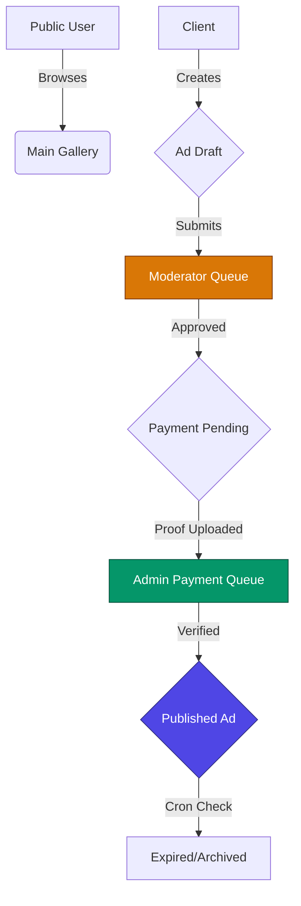

# 🚀 AdFlow Pro: Advanced Moderated Ads Marketplace


AdFlow Pro is a production-grade, full-stack marketplace platform built with **Next.js 16**, **Supabase**, and **Tailwind CSS**. It features a robust multi-role ecosystem, sophisticated ad moderation workflows, and an enterprise-level design system.

---

## ✨ Key Features

### 🏢 Multi-Role Ecosystem
- **Clients (Sellers):** Professional dashboard to manage ads, track performance, and handle payments.
- **Moderators:** Dedicated queue for quality control and listing approval.
- **Admins:** High-level dashboard with revenue analytics, payment verification, and system health monitoring.
- **Public Users:** Advanced search, filtering, and high-fidelity discovery.

### 🔄 Sophisticated Ad Lifecycle
- **State Machine:** Draft → Under Review → Approved → Payment Pending → Payment Verified → Published → Expired.
- **RBAC Security:** Strict role-based access control on every API route and UI component.
- **Payment Verification:** Manual proof-of-payment (screenshot) verification workflow for maximum security.

### 🎨 Premium Design System
- **Glassmorphic UI:** Modern, immersive interface with backdrop blurs and deep gradients.
- **Dynamic Animations:** Fluid transitions powered by **Framer Motion**.
- **Responsive Mastery:** Seamless experience across Mobile, Tablet, and Ultra-wide displays.

---

## 🛠️ Technology Stack

- **Frontend:** Next.js 16 (App Router), TypeScript, Tailwind CSS, Framer Motion.
- **Backend:** Next.js API Routes, Supabase (PostgreSQL), JWT Authentication.
- **Analytics:** Recharts for data visualization.
- **Form Management:** React Hook Form + Zod validation.
- **State/Auth:** React Context API + Lucide Icons.

---

## 📐 Platform Architecture



---

## 🚀 Getting Started

### 1. Prerequisites
- Node.js 18+ 
- Supabase Project

### 2. Environment Setup
Create a `.env.local` file with the following keys:
```env
NEXT_PUBLIC_SUPABASE_URL=your_project_url
NEXT_PUBLIC_SUPABASE_ANON_KEY=your_anon_key
SUPABASE_SERVICE_ROLE_KEY=your_service_role_key
JWT_SECRET=your_secure_unique_secret
```

### 3. Installation
```bash
npm install
```

### 4. Run Locally
```bash
npm run dev
```

---

## 📊 Operational Workflows

### Ad Ranking System
Ads are ranked based on a composite score:
- **Featured Boost:** +50 points
- **Package Weight:** (Basic x1, Standard x2, Premium x3)
- **Recency Decay:** New ads naturally appear higher.

### Cron Jobs
Automated system maintenance at `/api/cron`:
- `publish-scheduled`: Checks for ads ready to go live.
- `expire-ads`: Automatically archives ads that have finished their duration.

---

## 🛡️ Security
- **JWT Protection:** All sensitive routes require a valid Bearer token.
- **Service Role Admin:** Database interactions utilize high-privilege service roles safely on the server side.
- **Data Validation:** Every entry is strictly validated via Zod schemas and TypeScript interfaces.

---

## 📄 License
This project is licensed under the MIT License. Developed with ❤️ for professional marketers.
